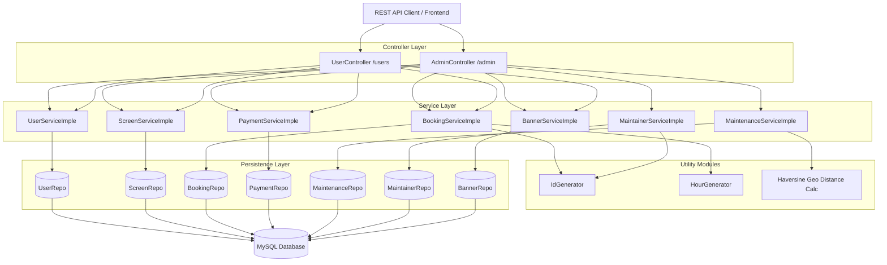

# Ahmedabad Advertisements Management System

A Spring Boot RESTful web application designed for managing digital advertising displays, booking broadcast slots, processing payments, and coordinating automated maintenance dispatch across Ahmedabad.

## Overview

The Ahmedabad Advertisements Management System streamlines the operational lifecycle of public digital advertisement screens. It addresses the complexity of managing physical ad screens across multiple geographic coordinates by providing:
- **Advertiser Slot Scheduling**: Automated collision detection, pricing calculation based on hourly rates, and automated slot suggestions during booking conflicts.
- **Dynamic Fault Recovery**: Automatic recalculation and reassignment of active ad bookings to the nearest functional display screens when a unit experiences hardware failure.
- **Proximity-Based Maintenance Dispatch**: Automated routing of maintenance complaints to the closest available field technician using the Haversine distance algorithm within a 15 km operating radius.

This system is built for municipal ad operators, outdoor advertising agencies, field maintenance engineers, and digital screen network managers.

## Features

### Digital Screen & Banner Management
- **Screen Inventory**: Register and track digital display units with location details, geographical coordinates (latitude/longitude), and quality ratings.
- **Location & Rating Queries**: Filter active screens by location name or performance rating.
- **Banner Hosting**: Associate visual banner creatives with specific display screens and manage their active display status.

### Booking & Slot Scheduling
- **Conflict-Free Scheduling**: Validates start/end timestamps and prevents overlapping bookings on the same screen.
- **Operating Hours Enforcement**: Automatically rejects and flags slots requested during night shutdown hours (10:00 PM to 8:00 AM).
- **Intelligent Slot Suggestion**: Generates alternative available time windows when a requested slot is occupied.
- **Dynamic Pricing & Updates**: Computes booking cost automatically based on duration (`₹100/hour`), recalculating additional balances or refund amounts when bookings are updated.
- **Status Lifecycle**: Tracks reservations across `PENDING`, `CONFIRMED`, and `CANCELLED` states.

### Maintenance & Geo-Dispatch
- **Automated Screen Failover**: When a screen is flagged as damaged (`DAMAGE`), active bookings are dynamically reassigned to the nearest operational screen.
- **Field Engineer Allocation**: Automatically calculates Haversine distances to locate and assign the nearest available maintainer within a 15 km radius.
- **Screen Repair Resolution**: Marks repaired screens as `FIXED` and active while preserving transferred bookings on their designated backup screens.

### User & Payment Processing
- **Role-Based Entity Separation**: Manages system users under `ADMIN`, `ADVERTISER`, and `MAINTAINER` roles with active status tracking.
- **Transaction Tracking**: Records transaction IDs, payment timestamps, and updates booking confirmation upon successful payment.

## Architecture

The application follows a standard layered Spring Boot architecture with separation of concerns across controllers, service implementations, repositories, and data models:



## Technology Stack

| Layer | Technology | Purpose |
|---|---|---|
| Language | Java 21 | Core programming language runtime |
| Framework | Spring Boot 3.4.3 | Application framework and dependency injection |
| Web | Spring Web MVC | RESTful API controller endpoints |
| Validation | Spring Boot Starter Validation (Hibernate Validator) | Request payload validation (`@Valid`, Jakarta Validation) |
| Persistence | Spring Data JPA / Hibernate | Object-relational mapping and database repository queries |
| Database | MySQL (Connector/J 8.3.0) | Relational database storage |
| Mail | Jakarta Mail 2.0.1 | Email handling utility library |
| JSON Processing | Jackson 2.18.2 | Serialization and deserialization of JSON payloads |
| Build Tool | Apache Maven (Maven Wrapper) | Dependency management and build automation |
| Testing | JUnit 5 & Spring Boot Starter Test | Unit and integration testing framework |

## Project Structure

```text
Advertisement/
├── README.md
└── Advertisments/
    ├── pom.xml                                 # Maven configuration and dependencies
    ├── mvnw / mvnw.cmd                         # Maven wrapper scripts
    └── src/
        ├── main/
        │   ├── java/com/gov/Advertisments/
        │   │   ├── AdvertisementsApplication.java  # Main Spring Boot entry point
        │   │   ├── GlobalExceptionHandler.java    # Global REST validation and exception handler
        │   │   ├── Controller/                     # REST API Controllers (AdminController, UserController)
        │   │   ├── Model/                          # JPA Entities and Data Transfer Objects (DTOs)
        │   │   │   ├── Enums/                      # Enums (Role, BookingStatus, PaymentStatus, etc.)
        │   │   │   ├── Request/                    # Request payload DTOs with validation rules
        │   │   │   └── Response/                   # Response DTOs and custom exceptions
        │   │   ├── Repository/                     # Spring Data JPA Repository interfaces
        │   │   └── ServiceImple/                   # Business logic implementations and utilities
        │   │       └── OtherImple/                 # ID and hour calculation utilities
        │   └── resources/
        │       └── application.properties          # Database connection and JPA configuration
        └── test/
            └── java/com/gov/Advertisments/
                └── AdvertisementsApplicationTests.java # Application context test suite
```

## Getting Started

### Prerequisites

Ensure you have the following installed on your system:
- **Java Development Kit (JDK) 21** or later
- **MySQL Server 8.0+**
- **Git**

### Installation

1. Clone the repository:
   ```bash
   git clone <repository-url>
   cd Advertisement/Advertisments
   ```

2. Create the MySQL database:
   ```sql
   CREATE DATABASE advertisement;
   ```

### Configuration

Configure the database connection settings in [application.properties](file:///Users/ayaz/Advertisement/Advertisments/src/main/resources/application.properties):

```properties
spring.application.name=Advertisements

spring.jpa.hibernate.ddl-auto=update
spring.datasource.url=jdbc:mysql://localhost:3306/advertisement
spring.datasource.username=YOUR_DB_USERNAME
spring.datasource.password=YOUR_DB_PASSWORD
spring.datasource.driver-class-name=com.mysql.cj.jdbc.Driver

spring.jpa.properties.hibernate.dialect=org.hibernate.dialect.MySQL8Dialect
spring.jpa.show-sql=true
```

> [!NOTE]
> Update `spring.datasource.username` and `spring.datasource.password` to match your local MySQL credentials.

### Running the Project

From the `Advertisments` project directory, run:

```bash
./mvnw spring-boot:run
```

On Windows:
```cmd
mvnw.cmd spring-boot:run
```

The application starts by default on port `8080` (e.g. `http://localhost:8080`).

### Build

To compile and package the application into an executable JAR:

```bash
./mvnw clean package
```

The built JAR file will be generated under `Advertisments/target/`.

### Testing

Execute unit and integration tests using:

```bash
./mvnw test
```

## API Overview

### User & Advertiser Endpoints (`/users`)

| Method | Endpoint | Description |
|---|---|---|
| `GET` | `/users/screens` | Fetch all registered advertisement screens |
| `GET` | `/users/get-screens?location={loc}&active={bool}` | Filter screens by location and active status |
| `GET` | `/users/screens/rating/{rating}` | Get screen locations filtered by rating |
| `POST` | `/users/booking` | Create a new slot booking request |
| `GET` | `/users/booking/{bookingId}` | Retrieve details for a specific booking ID |
| `PATCH` | `/users/booking/{bookingId}` | Modify booking start/end time or assigned screen |
| `DELETE` | `/users/booking/{bookingId}` | Cancel an existing booking |
| `POST` | `/users/payment/{bookingId}` | Process payment for a booking and confirm reservation |
| `POST` | `/users/banners` | Upload / register an advertisement banner for a screen |
| `DELETE` | `/users/banners/{id}` | Deactivate a banner by ID |

### Admin Endpoints (`/admin`)

| Method | Endpoint | Description |
|---|---|---|
| `GET` | `/admin` | List all active users |
| `GET` | `/admin/role?roles={ROLE}` | Filter users by role (`ADMIN`, `ADVERTISER`, `MAINTAINER`) |
| `POST` | `/admin` | Create a new user profile |
| `PATCH` | `/admin/update/{email}` | Update user profile details |
| `DELETE` | `/admin/remove-user/{email}` | Soft-delete / deactivate a user |
| `POST` | `/admin/screens` | Register a new screen with coordinates and rating |
| `DELETE` | `/admin/screens/{id}` | Deactivate a screen |
| `GET` | `/admin/bookings` | List all system bookings |
| `GET` | `/admin/bookings/{status}` | Filter bookings by status (`PENDING`, `CONFIRMED`, `CANCELLED`) |
| `GET` | `/admin/payments?status={status}` | List payments filtered by status (`SUCCESS`, `PENDING`, `FAILED`) |
| `GET` | `/admin/banners` | List all active banner configurations |
| `POST` | `/admin/maintenance` | Log a maintenance issue (triggers auto-failover & technician routing) |
| `PATCH` | `/admin/maintenance/{complaintId}` | Update an existing maintenance complaint |
| `POST` | `/admin/maintainer` | Register a field maintenance engineer with GPS coordinates |
| `GET` | `/admin/maintainer` | List all maintainers |
| `GET` | `/admin/maintainer/{maintainerId}` | Retrieve maintainer details by ID |
| `PATCH` | `/admin/maintainer/{maintainerId}` | Update maintainer profile and location |
| `DELETE` | `/admin/maintainer/{maintainerId}` | Mark maintainer status as `INACTIVE` |
| `POST` | `/admin/maintainer/fixed/{id}` | Mark maintenance task as resolved and re-activate screen |

## Usage Examples

### 1. Booking an Advertisement Slot
```bash
curl -X POST http://localhost:8080/users/booking \
  -H "Content-Type: application/json" \
  -d '{
    "startTime": "2026-10-05T10:00:00",
    "endTime": "2026-10-05T14:00:00",
    "advertiserName": "AcmeCorp",
    "screenIds": 1
  }'
```

### 2. Processing Payment for Booking
```bash
curl -X POST http://localhost:8080/users/payment/1
```

### 3. Registering a Screen Maintenance Issue
```bash
curl -X POST http://localhost:8080/admin/maintenance \
  -H "Content-Type: application/json" \
  -d '{
    "issue": "Display backlight malfunction",
    "screenId": 1,
    "adminId": 1
  }'
```

## Security Considerations

- **Input Validation**: Request bodies are validated using Jakarta/Hibernate annotations (`@Valid`, `@NotNull`, `@NotBlank`) with centralized errors handled in `GlobalExceptionHandler`.
- **Credential Storage**: Passwords in user requests are currently stored as plain text. Integrating Spring Security with `BCryptPasswordEncoder` and JWT authentication is recommended for production deployment.
- **Database Credentials**: Do not commit production database passwords to version control; utilize environment variables (`SPRING_DATASOURCE_PASSWORD`) in production environments.

## Roadmap

### Implemented
- [x] Screen inventory registration with geo-coordinates and ratings
- [x] Conflict detection and auto slot suggestion for bookings
- [x] Night operating hours enforcement (10 PM – 8 AM)
- [x] Dynamic hourly rate calculation and refund/delta calculations
- [x] Automatic screen failover to nearest screen during maintenance
- [x] Haversine-based nearest maintainer allocation (< 15 km)
- [x] Payment record generation and status management
- [x] Global exception handling and validation feedback

### Planned & Future Ideas
- [ ] Integration of Spring Security with JWT token authentication and role-based route protection
- [ ] Integration of SMTP service for automated email alerts on maintenance dispatch and booking confirmations
- [ ] Integration with a live payment gateway (Razorpay / Stripe)
- [ ] Multi-screen concurrent booking support in a single transaction
- [ ] Swagger / OpenAPI documentation UI integration

## Contributing

Contributions are welcome! To contribute:
1. Fork the repository.
2. Create a feature branch (`git checkout -b feature/new-feature`).
3. Commit your changes with clear messages (`git commit -m 'Add new feature'`).
4. Push to the branch (`git push origin feature/new-feature`).
5. Open a Pull Request.

## License

The license for this project has not yet been specified.

## Acknowledgements

- [Spring Boot](https://spring.io/projects/spring-boot)
- [Hibernate ORM](https://hibernate.org/orm/)
- [MySQL Connector/J](https://dev.mysql.com/doc/connector-j/en/)
